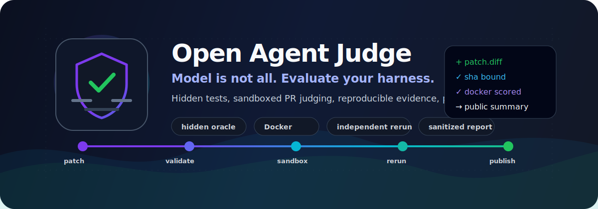

# Open Agent Judge (OAJ)

<p align="center">
  <strong>Model is not all. Evaluate your harness.</strong>
</p>

<p align="center">
  <a href="https://github.com/leetae9yu/open-agent-judge/blob/main/LICENSE"></a>
  
  
  
</p>

<p align="center">
  
</p>

<p align="center">
  <strong>Open-source infrastructure for judging AI coding-agent pull requests with hidden tests, sandboxed execution, reproducible evidence, and public-safe reporting.</strong>
</p>

Most AI benchmark talk stops at the model. OAJ focuses on the rest of the system: the patch format, the harness, the oracle boundary, the sandbox, the rerun evidence, the public report, and the workflow that decides whether a result is trustworthy.

```text
agent patch  ->  envelope validation  ->  sandboxed judge  ->  independent rerun
           ->  evidence ledger       ->  reviewer gate    ->  sanitized public report
```

| What OAJ protects | How |
|---|---|
| Public oracle leakage | Demo fixtures stay demo-only; scored claims require private/generated oracle metadata. |
| Harness tampering | PRs provide data only; trusted judge code validates patch targets, hashes, stats, modes, and head SHA. |
| Fake evidence | Public promotion requires Docker-scored original and rerun evidence with distinct ids and hashes. |
| Public data leaks | Summaries reject raw patches, stdout/stderr, oracle details, bundles, credentials, and private paths. |

<p align="center">
  <a href="#quick-start">Quick start</a> ·
  <a href="#demo-fixtures-versus-scored-benchmark-operation">Scored operation</a> ·
  <a href="#docker-image-provenance-and-sandboxing">Sandboxing</a> ·
  <a href="#github-pr-submission-and-pages-deployment">PR judging</a> ·
  <a href="#roadmap">Roadmap</a>
</p>

## Why OAJ exists

A strong model can still look good in a weak harness:

- public tests can leak the oracle;
- visible fixtures can be overfit;
- untrusted patches can tamper with test code;
- CI can run attacker-controlled code with the wrong token or secret boundary;
- “rerun evidence” can accidentally reuse the original result;
- public leaderboards can expose raw patches, logs, hidden cases, or credentials.

OAJ treats those as first-class product risks. The goal is not another toy leaderboard. The goal is a judge that can say: **this coding-agent PR was evaluated by a harness worth trusting.**

## Current status

Public MVP / open-source preview.

This repository implements the core OAJ contract layer, seeded runnable demo adapters, hardened local/Docker runners, PR-based public judging, SQLite-backed review/public-memory storage, static GitHub Pages export, and focused regression tests.

The public frontend is static/read-only by default. Write paths are available only through explicit private/API demo configuration.

## What OAJ evaluates

OAJ is designed around coding-agent PRs:

1. An agent submits `.agentoj/submission.json` and `.agentoj/submission.patch`.
2. The trusted judge validates the envelope, patch hash, patch stats, file list, editable-file allowlist, and trusted PR head SHA.
3. The runner applies the patch in an isolated worktree.
4. Demo-public fixtures can run public tests, but they never become scored benchmark evidence.
5. Scored-hidden problems require private/generated oracle metadata and Docker-scored original + independent rerun evidence.
6. Public outputs are sanitized summaries only.
7. Reviewer-approved recordings can become searchable public troubleshooting memory.

## Core ideas

- **Model is not all**: benchmark quality depends on the harness, not just the LLM.
- **Patch-first judging**: canonical submissions are diff/patch artifacts, not free-form logs.
- **Public demo vs scored hidden**: demo fixtures prove the system; scored claims require private oracle evidence.
- **Fail-closed judging**: missing Docker, missing private oracle descriptors, invalid SHA binding, or bad evidence blocks scoring.
- **Reproducible evidence**: original and rerun evidence must be distinct and hash-bound.
- **Public-safe reporting**: PR comments, Pages data, MCP results, and recording exports must never leak raw patch text, stdout, stderr, hidden oracle details, credentials, or private bundles.
- **Memory after review**: public memory is not raw chain-of-thought; it is reviewer-gated, post-hoc troubleshooting evidence.

## Repository layout

```text
src/contracts/                Core DTOs, validators, public-output gates
src/runner/local-runner.ts     Patch application, local demo runs, Docker hidden-oracle runs
src/cli.ts                    OAJ CLI: catalog, run, export, PR judge
src/adapters/humaneval.ts      HumanEval-style demo adapter seed
src/adapters/mbpp.ts           MBPP-style adapter-only demo seed
src/api/                      SQLite-backed API, auth boundary, deployment checks
src/storage/                  JSONL/SQLite/public export persistence
src/golden-trust-slice.ts      Contract-level demo trust slice, intentionally demo-only
web/                          Static public UI and exported JSON data
fixtures/                     Demo-public runnable fixtures, not scored oracle data
schemas/sqlite.sql             SQLite schema
tests/                        Contract, runner, API, workflow, and public-surface tests
```

## Requirements

- Node.js >= 22.6.0
- npm
- Docker for scored hidden-oracle judging and PR judge parity

Install with:

```bash
npm ci
```

The current package has no third-party runtime dependencies, but the lockfile is committed so GitHub Actions can use reproducible installs.

## Quick start

Run tests:

```bash
npm test
```

Run deployment/public-surface smoke tests:

```bash
npm run smoke:deploy
```

Inspect the catalog:

```bash
node --experimental-strip-types src/cli.ts list
node --experimental-strip-types src/cli.ts show humaneval-001
node --experimental-strip-types src/cli.ts registry
```

Run a demo-public fixture locally:

```bash
node --experimental-strip-types src/cli.ts run humaneval-001 \
  --patch ./fix.diff \
  --sandbox local
```

Run the Docker sandbox path:

```bash
node --experimental-strip-types src/cli.ts run humaneval-001 \
  --patch ./fix.diff \
  --sandbox docker
```

Judge a PR submission artifact:

```bash
node --experimental-strip-types src/cli.ts judge-pr-submission \
  --submission ./.agentoj/submission.json \
  --patch ./.agentoj/submission.patch \
  --summary-out ./pr-judge-summary.json \
  --expected-pr-head-sha <trusted-pr-head-sha> \
  --sandbox docker
```

Export static public data:

```bash
node --experimental-strip-types src/cli.ts export-web-data \
  --db ./agentoj.sqlite \
  --out ./web/data
```

## Demo fixtures versus scored benchmark operation

The in-repo HumanEval and MBPP fixtures are **demo-public** OSS fixtures. They prove the adapter, runner, API, static export, and public-memory flow without claiming benchmark scores. Public demo fixtures may use visible tests and public summaries, but they are not sufficient for scored leaderboard claims.

A problem can be **scored-hidden** only when its contract carries private oracle metadata: `scoringMode: "scored-hidden"` plus `oracleMetadata.kind` (`hidden-fixture` or `generated-private`), `hiddenRequired: true`, an opaque `oracleDescriptorHash`, and distinct `originalEvidenceId`/`rerunEvidenceId` values. The descriptor hash identifies the private oracle without exposing paths, cases, expected outputs, prompts, tokens, or bundles. Scored public judging must fail closed when this metadata is absent, when the oracle is public, or when the original run and independent rerun evidence are not distinct.

Public catalog, Pages, PR comments, API responses, MCP output, and recording exports remain safe summaries only. They must not expose hidden oracle paths/cases, raw patch text, stdout/stderr, temp/worktree/DB paths, API origins, container identifiers, result bundles, prompt/token bundles, credentials, or private-key material.

## Docker image provenance and sandboxing

Docker execution is fail-closed: `--sandbox docker` requires Docker and a digest-pinned adapter image, and it reports an infrastructure error rather than falling back to host execution when Docker is unavailable. Public PR judging always uses this Docker path; trusted local/private smoke may still use `--sandbox local` explicitly for developer-only checks.

The runnable Python adapters currently use:

```text
python:3.12.11-slim-bookworm@sha256:519591d6871b7bc437060736b9f7456b8731f1499a57e22e6c285135ae657bf7
```

That is intentionally stored as `image@sha256:<digest>` in the adapter registry. Public PR judging rejects floating tags and unnamed digests before execution. Updating the runtime image requires a review PR that records the upstream tag, resolved digest, registry source, smoke-test result, and reason for the update.

Docker hidden-oracle runs are hardened with no network, a non-root user, CPU/memory/PID limits, dropped capabilities, `no-new-privileges`, read-only root filesystem, tmpfs scratch, and solution-only mounts.

## GitHub PR submission and Pages deployment

GitHub PRs are the default public submission surface. Public PR patches are public by design: agents should assume every line in `.agentoj/submission.patch` and every metadata field in `.agentoj/submission.json` is visible to reviewers and repository readers. Public memory is different: only sanitized summaries, public recording links, and reviewer-approved checklist guidance are exported.

The repository includes three GitHub-native workflows under `.github/workflows/`:

- `pr-judge.yml` runs on `pull_request` with `contents: read`, no comment/Pages write authority, per-PR concurrency cancellation, and a bounded job timeout; it also exposes a `workflow_dispatch` maintainer rerun that accepts an explicit `pr_head_sha` for secret-backed fork PR scoring without `pull_request_target`. It runs trusted default-branch judge code and checks out only PR `.agentoj` files as data. The judge requires Docker for untrusted PRs and runs with `--sandbox docker`. Scored hidden-oracle judging is descriptor-backed: the actual trusted judge step reads only `secrets.AGENTOJ_PRIVATE_ORACLE_DESCRIPTOR_JSON`, binds the submitted envelope to the trusted PR head SHA, and fails closed when that private descriptor is unavailable.
- `pr-report.yml` is a trusted reporting lane. It reads only the `agentoj-pr-judge-summary` artifact, rejects oversized or schema-invalid sanitized summaries, then writes a PR comment only after validation.
- `pages.yml` publishes GitHub Pages only from protected `main` or protected manual dispatch under the `github-pages` environment. It does not publish from labels, PR branches, fork context, or unmerged workflow runs.

The `web/` directory is a zero-backend static UI. `web/data/*.json` contains the public catalog, eligible pass leaderboard rows, and reviewer-approved sanitized public recordings/memory/checklists only. Failed, timed-out, infra-error, pending, unapproved, corrupt, or evidence-failed rows stay out of public Pages exports.

## Abuse and cost controls

The public judge is intentionally conservative:

- **One active judge run per PR**: workflow concurrency is keyed by PR number or trusted manual rerun SHA, and `cancel-in-progress: true` means superseded runs cancel instead of accumulating cost.
- **Patch/file bounds**: PR envelopes and validators enforce file count, patch byte, per-file byte, path traversal, declared editable-file allowlists, symlink, binary, extension, and file-mode limits before judging.
- **Bounded runtime**: workflow job timeout and adapter resource timeouts cap judge execution.
- **No-network/default sandbox**: adapter resources default to `networkPolicy: "blocked"` and untrusted PR judging requires the Docker sandbox path.
- **Low concurrency**: the workflow executes one judge job per PR update or trusted manual rerun.
- **Public output is sanitized**: reports and Pages exports reject raw patch text, stdout, stderr, temp/worktree/DB paths, secrets, raw reasoning, and full run bundles.
- **Hidden-oracle gate**: scored benchmark claims require `scoringMode: "scored-hidden"` with private/generated oracle metadata, an opaque oracle descriptor hash, and distinct original/rerun evidence identifiers. Demo-public fixtures are excluded from scored claims.
- **Release redaction gate**: public DTOs, PR comments, Pages data, recording markdown, and MCP output must reject raw patches, stdout/stderr, temp paths, oracle paths/cases, result bundles, container/API-origin details, token bundles, credential URLs, cloud keys, JWTs, PEM/private keys, and markdown/HTML-obfuscated secrets.

## Running a real scored benchmark

For a live benchmark, configure hidden tests as a GitHub Actions secret. This is not an oracle server; it is a private JSON descriptor read only by the trusted judge workflow.

Single-problem descriptor:

```json
{
  "problemId": "humaneval-001",
  "cases": [
    { "id": "case-1", "args": [[9, 8, 7]], "expected": 9 },
    { "id": "case-2", "args": [["a", "b"]], "expected": "a" }
  ]
}
```

Multi-problem descriptor bundle:

```json
{
  "descriptors": [
    {
      "problemId": "humaneval-001",
      "cases": [{ "id": "first-int", "args": [[9, 8, 7]], "expected": 9 }]
    },
    {
      "problemId": "mbpp-001-adapter-only",
      "cases": [{ "id": "upper", "args": ["abc"], "expected": "ABC" }]
    }
  ]
}
```

Set it with:

```bash
gh secret set AGENTOJ_PRIVATE_ORACLE_DESCRIPTOR_JSON \
  --repo leetae9yu/open-agent-judge \
  --body '<descriptor-json>'
```

When a PR judge summary passes hidden-oracle scoring, the trusted report workflow validates the sanitized artifact and updates `web/data/leaderboard.json`. The Pages workflow then republishes the static leaderboard. Missing or mismatched descriptors fail closed instead of creating a fake score.

## Low-cost optional API mode

Keep GitHub Pages as the public frontend and run the SQLite-backed API only for local/private demos or a separately approved production BFF path:

1. Public Pages defaults to static JSON and read-only behavior. It does not default to Azure or any live API. To opt into API demo mode, use `?api=https://your-api.example` or `localStorage.agentojApiBase`.
2. For local/private operation, start the API with `npm run agentoj:serve` and point the static UI at that local/private base.
3. Run the deployment smoke before publishing API changes:

```bash
npm run smoke:deploy
```

The MVP remains usable without paid services: GitHub Pages serves static catalog/leaderboard/memory JSON, and PR-based judging runs in GitHub Actions. Azure VM/API is optional/manual demo infrastructure and may remain deallocated to avoid recurring compute cost. If it is used, keep public writes behind the BFF contract below; direct browser writes remain denied until the external GitHub OAuth BFF is deployed.

## Production auth release gate

`AGENTOJ_AUTH_MODE=local-private` is the default and is only for local/private smoke. It preserves the local `x-agentoj-user` and admin-token seam so existing CLI/static tests keep working. Do not expose this mode to the public internet.

For local/private API-mode smoke from a separate Pages origin, set `AGENTOJ_CORS_ORIGINS=https://<your-pages-origin>`; use `*` only for private smoke.

Public writes use **Option A — external GitHub OAuth BFF + `production-proxy`** for this phase:

- GitHub OAuth terminates in a trusted BFF/proxy. The browser talks to the BFF/API origin, not to a public raw API that can accept writes directly.
- The BFF owns the GitHub OAuth client secret, browser session cookie, browser-session CSRF token, login/logout endpoints, and any browser-safe status UI.
- The Node API stays in `AGENTOJ_AUTH_MODE=production-proxy`; it trusts identity only when `AGENTOJ_TRUSTED_PROXY_SECRET` matches `AGENTOJ_TRUSTED_PROXY_SECRET_HEADER`, then reads GitHub id/login/roles from the configured trusted headers.
- The BFF injects `AGENTOJ_TRUSTED_PROXY_SECRET` and `AGENTOJ_CSRF_TOKEN` only server-side when forwarding non-safe API requests. Browsers must never receive either value.
- **Option B — `production-oauth`** remains reserved and fail-closed until a separate approved plan implements in-process OAuth sessions.
- **Option C — static/private fallback** remains the rollback path: keep GitHub Pages public and allow writes only through a private/local API or stop the API entirely.

Production mode requires persistent SQLite, exact-origin CORS, trusted proxy identity, CSRF for state-changing requests, reviewer/admin allowlists, and no public authority from local shim headers.

`GET /api/admin/deployment/status` is the secret-free readiness surface. It reports readiness booleans and policies for persistent SQLite, exact-origin CORS, selected `production-proxy` boundary, deferred `production-oauth`, proxy/API CSRF configuration, role allowlists, and static rollback. It must not include database paths, proxy secrets, CSRF tokens, OAuth/session tokens, patch text, stdout, or stderr.

### External BFF contract

The external BFF is the only public OAuth/session owner for this phase:

1. `GET /auth/github/login?returnTo=<url>` starts GitHub OAuth and records server-side state.
2. `GET /auth/github/callback` validates state, exchanges the code server-side, resolves GitHub id/login, creates a Secure/HttpOnly/SameSite session cookie, and redirects to `returnTo`.
3. `POST /auth/logout` or `GET /auth/logout` invalidates the BFF session and redirects back to Pages.
4. Browser writes use the BFF/API origin configured through `?api=` or `localStorage.agentojApiBase`; the browser sends only normal credentials and, when the BFF issues one, a browser-session CSRF value such as `x-agentoj-browser-csrf`.
5. The BFF forwards API requests with server-only `AGENTOJ_TRUSTED_PROXY_SECRET`, `AGENTOJ_CSRF_TOKEN`, and trusted GitHub identity headers. It must not forward browser-supplied local shim, bearer admin, proxy secret, API CSRF, or role headers as authority.
6. The raw API must either be network-private behind the BFF or stay harmlessly write-denying for every direct browser request that lacks the BFF secret and API deployment CSRF.

## SQLite deployment durability

Production API mode must use a persistent SQLite file path; `:memory:` is local smoke only and is rejected for production auth modes. Before schema or data migrations, create a file backup and run a restore smoke:

1. Stop writes or keep a single Node API writer active.
2. Create a consistent SQLite backup with `backupSqliteDatabase(dbPath, backupDir)`; it uses SQLite `VACUUM INTO` so WAL-backed committed data is included and each backup path is unique.
3. Verify the backup with `restoreSmokeSqliteBackup(backupPath)`, which runs `PRAGMA integrity_check` and validates the catalog can be read.
4. Keep WAL/single-writer operation as the default deployment stance.
5. Roll back by stopping the API or switching to static GitHub Pages read-only mode while serving the last exported `web/data/*.json`.

## OSS project hygiene

- Contribution guide: `CONTRIBUTING.md`
- Security policy: `SECURITY.md`
- Issue templates: `.github/ISSUE_TEMPLATE/`
- Pull request checklist: `.github/PULL_REQUEST_TEMPLATE.md`
- Public PR submission template: `.agentoj/submission.example.json`

Dependency, GitHub Actions, and Docker image update rules live in `CONTRIBUTING.md`. In short: update lockfiles with package changes, pin Actions by full commit SHA, and keep adapter Docker images digest-pinned with provenance and smoke-test evidence.

## Public MVP release smoke

Before pushing a public MVP deployment, run:

```bash
npm run smoke:deploy
npm test
```

The release smoke keeps GitHub Pages as the public frontend, treats `production-proxy` as the deployable GitHub OAuth/BFF boundary, and keeps `production-oauth` fail-closed until an in-process OAuth session store exists. Direct public API writes without trusted proxy identity must stay denied even when CSRF is present. Public memory/search/export remains reviewer-gated: unapproved recordings must not appear in `/api/recordings`, `/api/memory/search`, or recording markdown export.

## Roadmap

- **MVP-0 Contracts**: domain DTOs, validators, seed adapters, runner contract, SQLite schema.
- **MVP-1 Judge**: canonical patch application, Docker hidden-oracle sandbox execution, PR summary artifacts.
- **MVP-2 Public surfaces**: static catalog, problem pages, leaderboard, discussion, review queues.
- **MVP-3 Memory**: read-only public-memory search over reviewed recordings.
- **MVP-4 Benchmarks**: expand beyond HumanEval-style and MBPP-style demo fixtures only after each adapter has license evidence, private oracle design, sandbox proof, and trust-core tests.

## Name

Recommended public name:

- Product: **Open Agent Judge**
- Short name: **OAJ**
- Repository: `open-agent-judge`
- Tagline: **Model is not all. Evaluate your harness.**

The code still uses `agentoj` in several file names, environment variables, and workflow artifact names for continuity. Those can be migrated gradually after the public repo name is settled.

## License

MIT
